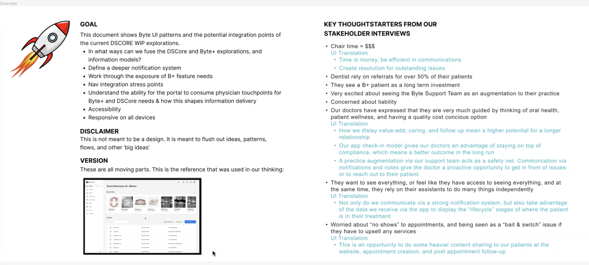
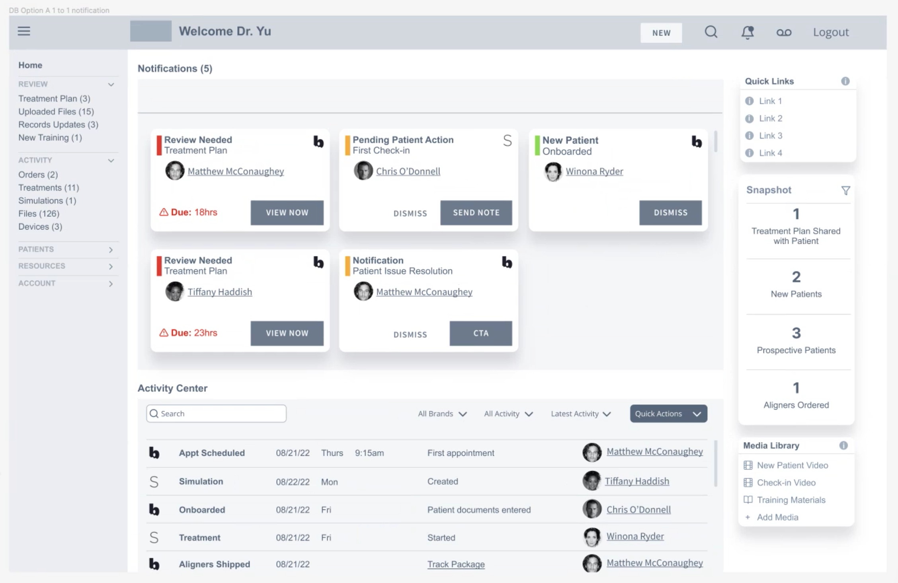
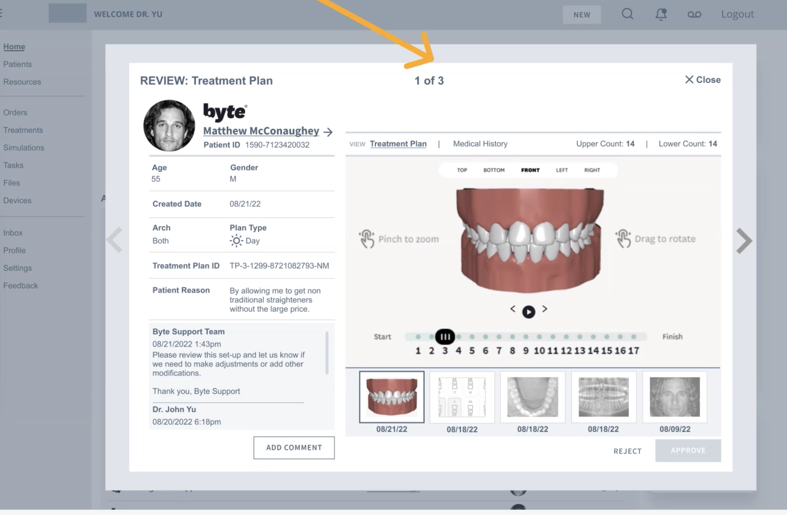
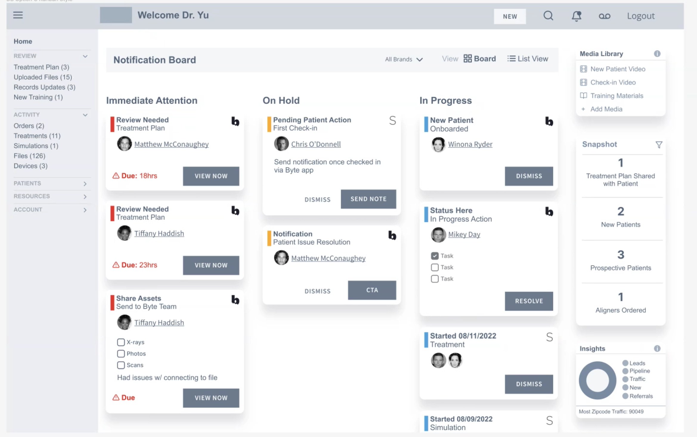

# Byte+ <!-- omit in toc -->
## Table of Contents <!-- omit in toc -->
- [1. Introduction](#1-introduction)
- [2. Open Questions](#2-open-questions)
  - [2.1. General Concept](#21-general-concept)
  - [2.2. Integration / Connection to DSCore](#22-integration--connection-to-dscore)
  - [2.3. !NotifBoard](#23-)
  - [2.4. Data Model](#24-data-model)
  - [2.5. Mobile Application](#25-mobile-application)
  - [2.6. Components for Byte+](#26-components-for-byte)
  - [2.7. User Journey of Treatment Planing](#27-user-journey-of-treatment-planing)
    - [Synchronise User Journey (Byte+ & DSCore)](#synchronise-user-journey-byte--dscore)
  - [2.8. Architectural Tasks](#28-architectural-tasks)
- [3. Notes](#3-notes)
- [4. Next Steps](#4-next-steps)
  - [4.1. Architectural Tasks](#41-architectural-tasks)
  - [4.2. OnBoarding](#42-onboarding)
- [5. Glossary](#5-glossary)

# 1. Introduction

- Boundaries: Byte+ integrates the dentist into the process
  - Dentist should approve the treatment in B+
  - B+ shall become part of a dentist clinic
  - Differences: App is corrently consumer oriented and driven
    - Shall be an alternativ to SureSmile
  - Take TeleHealth Model into the market of SureSmile
    - cheaper opportunity for the same topic
    - make SureSmile a better product by having a cheaper starting point for patients
  - Step into the field between Byte and SureSmile
- Treatment handling, such as Crone, Abutment and others are similar to B+
  - Shall be extended and harmonised to fulfill different usecases
- Landing page
  
- DSCore is **NOT** an PMS system
  - shall be included
  - do not make the impression, it is a little bit
- B+ want to be fast
  - Dentist approves treatment plan
  - Data goes to B+ team and then to the patient
  - Treatment plans could be synchronised with other treatments (abutment, suresmile, aligner, others)
  

---
---
# 2. Open Questions
## 2.1. General Concept
- [ ] Definitions of **ByteApp**, **Byte+** and **Hybrid Model**?
- [ ] Hybrid Model mentioned in Marketing Pages?
  - Integrate platform topics into existing application
- [ ] Is the app mainly **consumer driven and oriented**?
  - [ ] Platform(s)
  - [ ] User database

## 2.2. Integration / Connection to DSCore
- [ ] **Landing page** specific for B+ or not?
  - [ ] Activity Page on Dashboard would be a possible extension for DSCore
  - [ ] Notification Board could be elaborated as well in DSCore
  2.3. 
---
- **Patient**, **Subscription**, **Treatment**
  - [ ] Patient Account within DSCore?
  - [ ] Billing/Subscription Integration?
  - [ ] Treatment plan for Provider Account: is this a procedure?
  - [ ] Treatment handling is something B+ is a head of DSCore
    - Take a look at kanban-ish notification board for example
---
- Algorithms
  - [ ] Find a Dentist **matching algorithm**? <!-- omit in toc -->
---
- Patient booking (PMS)
  - [ ] **NexHealth** only US?
    - [ ] Global Alternative?
    - [x] Alexei / Maryna
  - [ ] Email to customers from DSCore?

## 2.4. Data Model
- [ ] What data model is used for the meshes?
- [ ] How is data exchange between App/Byte and DSCore?
- [ ] How is the dataflow between customer &harr; dentist &harr; DSCore &harr; Byte+?

## 2.5. Mobile Application
- [ ] Based on DSCore widgets and flutter?

---
---
## 2.6. Components for Byte+
- [ ] Upload patient data, such as pictures of patient (aka "smile selfies") in a **separate app/ur**l?
  - [ ] Platform(s)?
- [ ] **3D model** view for the customer?
  - [ ] Renderer integration will be **needed**

## 2.7. User Journey of Treatment Planing
- [ ] Onboarding of new dentists
  - [ ] DSCore based
  - [ ] FAQ pages
- [ ] Share information to smartphone application with patient
- [ ] Accounts from DSCore
  - [ ] Owner, Lab, Assistent, Guest
  - [ ] Subscription (or bundle)
- [ ] Connectivity/Integration to Implant Planning Software

### Synchronise User Journey (Byte+ & DSCore)
- [ ] Where to fork the implementation?
  - [ ] different landing pages?
- [ ] Light-weight integration?
  - [ ] just a separate treatment as first step?

---
---
## 2.8. Architectural Tasks
- [ ] Different views for the complete situation
- [ ] Find overlaps, similar patterns, similar workflows, data representation, rendering and more
- [ ] Definition & description for treatment planning within DSCore
- [ ] Separate topics/issues into UX, services, workflow, data model and others
- [ ] Having a running instance of Byte
  - [x] Access received -> Geppi could help out
  - [ ] Realisation needed <!-- TODO: rensem -->
- [ ] Byte Team doesn't know that much about DSCore
- [ ] Strategic approach
- [ ] Take a look at the backend
  - [x] integrate COTS
- [ ] Integrate current Byte solution as intermediate
  - [ ] Data migration
- [ ] Salesforce <!-- TODO: rensem -->
- [ ] Move to DS Repo at some point
  - [ ] Concept for transition <!-- TODO: rensem -->

---
---
# 3. Notes
- Context view
  - Achieveable architecture not crystal clear
  - Integration into DSCore
  - UX concept
- Building block view
  - Blocks not completely clear
- Runtime view
  - How an order works unclear
- Deployment view
  - How the system is distributed
    - single cluster
    - separate app
    - multiple OS

---
---
# 4. Next Steps
## 4.1. Architectural Tasks
- [ ] Clarify questions with Byte Team <!-- TODO: rensem -->
  - [ ] Alignment with DSCore UI
  - [ ] Repository structure / Working style / ...
- [ ] First draft for diagrams (views)
  - [ ] Before Sept 19./20. <!-- TODO: rensem -->
    - [ ] Involvement of other teams?

---
## 4.2. OnBoarding
- Proposal
  - 2 senior engineers transfer for ramp up to CaseCollaboration
    - fullstack (no FE or BE)
      - from conceptional to deployment
      - as independent as possible
    - small teams (max 5 pers)
    - short iterations
      - know-how transfer before implementation
  - Ben (15y) & Bill (less)
    - JavaScript/TypeScript
  - CaseCollaboration
- Ping Michael Grosshans about Dailies <!-- TODO: rensem -->

---
---
# 5. Glossary
- [ ] Account CTR / Act CTR: <!-- TODO: rensem -->
- [x] referrals := *Empfehlung*
- [x] Byte+ will be scanner-agnostic := *Unabhängig von einem spezifischen Scanner; alle möglich*
- [ ] App is focused on handling the treatment by the customer
  - [ ] Dentist approves different steps
- [ ] Byte+ shall step into the gap between Byte and SureSmile
  