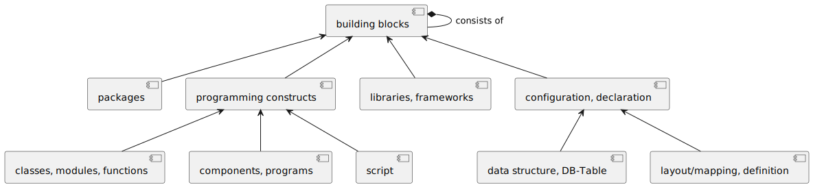
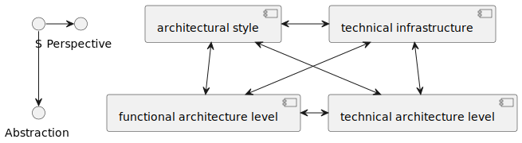
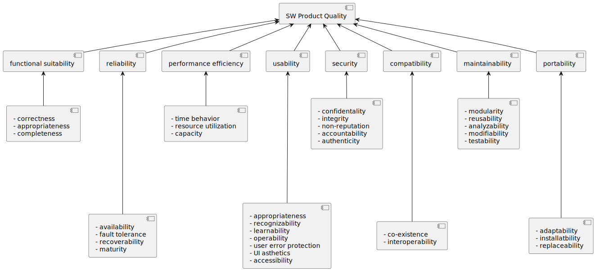

# Cheetsheet for CPSA-F <!-- omit in toc -->
### Table of Content <!-- omit in toc -->
- [1. Basic Concepts](#1-basic-concepts)
  - [1.1. Definitions of software architecture (R1)](#11-definitions-of-software-architecture-r1)
  - [1.2. Goals and benefits of software architecture (R1)](#12-goals-and-benefits-of-software-architecture-r1)
  - [1.3. Software architecture in the software lifecycle (R2)](#13-software-architecture-in-the-software-lifecycle-r2)
  - [1.4. Software architects' tasks and responsibilities (R1)](#14-software-architects-tasks-and-responsibilities-r1)
  - [1.5. Software architects and other stakeholders (R1)](#15-software-architects-and-other-stakeholders-r1)
  - [1.6. Development approach and software architecture (R1)](#16-development-approach-and-software-architecture-r1)
  - [1.7. Short- and long-term goals (R1)](#17-short--and-long-term-goals-r1)
  - [1.8. Explicit statement versus implicit assumptions (R1)](#18-explicit-statement-versus-implicit-assumptions-r1)
  - [1.9. Responsibilities of SW architects in the greater architectural context (R3)](#19-responsibilities-of-sw-architects-in-the-greater-architectural-context-r3)
  - [1.10. Types of IT systems (R3)](#110-types-of-it-systems-r3)
  - [1.11. Challenges of distributed systems (R3)](#111-challenges-of-distributed-systems-r3)
- [2. Design and Development](#2-design-and-development)
  - [2.1. Approaches and heuristics for architecture development (R1, R3)](#21-approaches-and-heuristics-for-architecture-development-r1-r3)
  - [2.2. Design software architectures (R1)](#22-design-software-architectures-r1)
  - [2.3. Influencing factors and constraints (R1-R3)](#23-influencing-factors-and-constraints-r1-r3)
  - [2.4. Cross-cutting concepts (R1)](#24-cross-cutting-concepts-r1)
  - [2.5. Patterns (R1, R3)](#25-patterns-r1-r3)
  - [2.6. Design principles (R1-R3)](#26-design-principles-r1-r3)
  - [2.7. Managing dependencies (R1)](#27-managing-dependencies-r1)
  - [2.8. Achieve quality requirements (R1)](#28-achieve-quality-requirements-r1)
  - [2.9. Design and define interfaces (R1-R3)](#29-design-and-define-interfaces-r1-r3)
- [3. Specification and communication of software architectures](#3-specification-and-communication-of-software-architectures)
  - [3.1. Quality requirements for technical documentation (R1)](#31-quality-requirements-for-technical-documentation-r1)
  - [3.2. Describe and communicate software architectures (R1, R3)](#32-describe-and-communicate-software-architectures-r1-r3)
  - [3.3. Models and notations to describe (R2-R3)](#33-models-and-notations-to-describe-r2-r3)
  - [3.4. Architectural views (R1)](#34-architectural-views-r1)
  - [3.5. Context view (R1)](#35-context-view-r1)
  - [3.6. Document cross-cutting concepts (R2)](#36-document-cross-cutting-concepts-r2)
  - [3.7. Describe interfaces (R1)](#37-describe-interfaces-r1)
  - [3.8. Document architectural decisions (R1-R2)](#38-document-architectural-decisions-r1-r2)
  - [3.9. Documentation as written communication (R2)](#39-documentation-as-written-communication-r2)
  - [3.10. Resources and tools for documentation (R3)](#310-resources-and-tools-for-documentation-r3)
- [4. Software architecture and quality](#4-software-architecture-and-quality)
  - [4.1. Quality models and quality characteristics (R1)](#41-quality-models-and-quality-characteristics-r1)
    - [ISO 25010](#iso-25010)
  - [4.2. Clarify quality requirements (R1)](#42-clarify-quality-requirements-r1)
  - [4.3. Qualitative analysis (R2-R3)](#43-qualitative-analysis-r2-r3)
  - [4.4. Quantitative evaluation (R2)](#44-quantitative-evaluation-r2)
- [5. Examples of software architecture](#5-examples-of-software-architecture)
  - [5.1. From requirements to solution (R3)](#51-from-requirements-to-solution-r3)
  - [5.2. Rationale of a technical implementation (R3)](#52-rationale-of-a-technical-implementation-r3)
---
---

# Introduction <!-- omit in toc -->
- R1 - Being able to ... - Will be part of examination
- R2 - Understanding ... - May be part of examination
- R3 - Knowing ... - Will **not** be part of examination

# 1. Basic Concepts
## 1.1. Definitions of software architecture (R1)

*Software architecture: the fundamental organization of a system embodied in its component, their relationships to each other and to the environment, and the principles guiding its design and evolution.*

*Defines the essential structures, overall technical concepts, and design decisions of a software system, and is the basis for the development of the entire system.*

### 1.1.1 Key Terms <!-- omit in toc -->
- **Fundamental organization**: ordering and given designated place
- **Components (aka Building Blocks)**: strutctural elements: subsystems, modules, classes, functions
- **Relationships**: interfaces, dependencies, associations
- **Environment**: data, control flow, events are transferred to and from possible different kinds of neighbors (--> context view)
- **Principles (aka Concept)**: rule that holds for the whole system or several parts of it
- **Design and evolution**: cross-cutting and system-wide decisions might become necessary during both initial design and ongoing evolution and maintenance of systems
-  **Software-Intensive Systems**: computer programs, procedures, and possibly associated documentation and data pertaining to the operation of a computer system
   -  a collection of building blocks
   -  **interface**: represents a well-defined access point to the system or its building blocks
   -  **building block**: is the central basic element from which the static structure of a software architecture is constructed
   

---
## 1.2. Goals and benefits of software architecture (R1)

### Essential goals and benefits <!-- omit in toc -->
- support the **design, implementation, maintenance, and operation** of systems
- achieve **quality requirements** (reliability, maintainability, changeability, security, etc.)
- achieve **functional requirements** or ensure that they can be met
  - taking global design decisions, spanning the context of several components
- ensure that the **system's structure and concepts are understood** by all relevant stakeholders
    - *conceptual integrity* means the design/architecture follows a consistent set of rules or decisions
      - necessary prerequiste for understandability and maintainability
- systematically **reduce complexity**
  - constructed in a way to facilitate development and maintenance
- specifiy **architectural relevant guidelines** for implementation and operation
  
---
## 1.3. Software architecture in the software lifecycle (R2)

> SW architects can:
> - **identify the consequences** of changes in requirements (functional, quality), technologies or the system environment in relation to software architecture
> - **elaborate on relationships** between IT-systems and the supported business and operational processes

### Software lifecycle (SLC) <!-- omit in toc -->
- describes all phases of a software product (planning, dev, use & retirement)
  - initial development:
    - designed and implemented from scratch
    - ADs are based on **initial requirements** and **influencing factors**
    - architecture established at this stage will have a **significat impact** on future evolution
  - evolution:
    - iterative changes that originat ein changing requirements, evolving technologies and lessons learned
  - servicing:
    - no turning back and it is considered legacy
    - changes are difficult and expensive
    - leaving most of underlying architectural problems **untouched**
  - phaseout:
    - no more changes to the software
  - closedown:
    - marks the **final end** of the line for a particular version of software
    - data migration still needed to be considered

---
## 1.4. Software architects' tasks and responsibilities (R1)

> Software architects are responsible for achieving the required or necessary quality and creating the architecture design for a solution.
> - **clarify and scrutinize requirements and constraints**, and refine them if necessary (functional & quality (non-functional) requirements)
> - **decide how to decompose the system** into building blocks, while determining dependencies and interfaces
> - **determine and decide on cross-cutting concepts**
> - **communicate and document the software architecture** based on views, architectural patterns, cross-cutting and technical concepts
> - **accompany the realization and implementation** of the architecture, integrate feedback, and ensure the consistency of src code
> - **analyze and evaluate SW architecture** with respect to risks involving quality requirements
> - **identify, highlight, and justify the consequences of ADs** to other stakeholders
  
### Explanation <!-- omit in toc -->
- no algorithmic approach; iteration to the rescue
  - architecture needs feedback, therefore architecture work is inherently iterative

### Software architects design and construct <!-- omit in toc -->
- building bloks
- interfaces between building blocks
- cooperation of building blocks
- cross-cutting concepts or rules
- selection of appropriate technologies
- adoption of suitable development and operation processes
  
### Software architects need to fulfill 6 important tasks <!-- omit in toc -->
1. clarify requirements
   - who are the stakeholders?
   - context and external interfaces
   - quality requirements
   - functional requirements
     - frequent execution
     - most important for stakeholders
     - critical timing or performance constraints
     - CRUD large amounts of data
     - critical parts of infrastructure
   - constraints
   - stability, validity, and importance of all previous points
2. design cross-cutting concepts
   - designing belongs to the primary tasks
   - concepts form the basis for conceptual integrity
   - important contribution to achieve the intrinsic qualities of system
   - cannot be handled by individual building blocks
3. design structures
   - designing belongs to the primary tasks
   - structures are subsystems, components, packages, name spaces or classes
   - in both white box and black box manifestations
4. communicate architecture
5. shepherd implementations
   - identify parts that violate or endanger consistency or deviate from chosen architecture
   - identify potential design or implementation decisions which could improve overall architecture
6. evaluate architecture
   - find out if the system can fulfill or satisfy its quality requirements
   - in this context we mean *product quality*
     1. how well it complies with or conforms to a given design
        - how it compares to competitors
     2. **how it meets non-functional requirements that support the delivery of functional requirements**
        - qualitative evaluation
        - quantitative evaluation

---
## 1.5. Software architects and other stakeholders (R1)

> Software architects are able to explain their role. 

*Many problems in software development cannot be solved by good programming alone, but need communication between stakeholders.*

### Software Architects will have at least the following four different categories of stakeholder <!-- omit in toc -->
1. **stakeholders with a business-, product- or domain focus**, e.g.PO, RE, business analyst.
   - communicate on requirements and/or their feasibility
     - clarify requirements
     - help identify conflicting requirements
     - support finding trade-offs between conflicting goals and requirements
     - explain the impact of requirements and constraints
     - support in prioritizing requirements and their development
2. **management stakeholders**, like PM or SM
   - communicate over organizational constraints, resources, schedules, etc.
     - technical consultancy
     - risk management
     - support in staffing
     - support in defining and sizing work packages
3. **technical stakeholders**, like SW devs, HW devs or IT operations
   - communicate on a detailed and specific technical level
     - communicate and explain AD
     - enable and prepare technical decisions
     - coach or help-to-coach
     - moderate in the discussion and design of interfaces
4. **stakeholders focused on specific quality attributes**, like IT security or QA

---
## 1.6. Development approach and software architecture (R1)

> Architecture work needs feedback, which is an inherent feature of iterative development approaches. Architects have to systematically optain feedback from other stakeholders.

### Benefits of iterative approach <!-- omit in toc -->
- early feedback
- early risk identification
- more time to fix problems
- better changes to adapt to changes in requirements, constraints, technology, team, etc.
- opportunities to practice every activity in dev process, especially deploy- and release-related

### Deming-Cycle or Plan-Do-Check-Adjust <!-- omit in toc -->
- **plan**: make architectural decisions to meet the known/given requirements
- **do**: exectue plan, implement decisions
- **check**: get feedback and evaluate
- **adjust**: improve or refine decisions

---
## 1.7. Short- and long-term goals (R1)

*Usually project goals tend to be more short-term, whereas architecture goals tend to be long-term.*

### Short-term and long-term <!-- omit in toc -->
- projects (sprints) typically last for a couple of weeks up to one or two years
- systems often remains in use for several years.

---
## 1.8. Explicit statement versus implicit assumptions (R1)

> Software architects:
> - excplicitly present assumptions or prerequisites
> - avoid implicit assumptions
> - know that implicit assumptions can lead to potential misunderstandings
> - formulate without doubting

*Very often things go wrong due to different people having different implicit assumptions about something. Software architects should be explicit in their decisions.*

Ensure explicitness in your work by:
- **explicitly documenting** quality requirements, e.g in form of quality scenarios
- **explicitly documenting** ADs
- **using clear and unambiguous terminology**, especially domain/business terminology
- **explicitly defining technical or cross-cutting concepts**
- **explicitly considering different perspectives**, f.ex. quality requirements, domain struture, interfaces, building blocks structure, technical infrastructure, etc.
- **explicitly devoloping cross-cutting concepts** to improve conceptual integrity (consistency)
- **explicitly analyzing and evaluating** your system, its architecture and code
- **explicitly asking stakeholders for feedback**

---
## 1.9. Responsibilities of SW architects in the greater architectural context (R3)

> Software architects are familiear with other architectural domains, f.ex.:
> - enterprise IT architecture
> - business and process architecture
> - information architecture
> - infrastructure and process architecture
> - hardware and processor architecture

---
## 1.10. Types of IT systems (R3)

> Software architects know different types of IT systems, f.ex.:
> - information systems
> - decision support, data warehouse or business intelligence systems
> - mobile systems
> - batch processing or systems
> - hardware-related systems

---
## 1.11. Challenges of distributed systems (R3)

> Software architects are able to:
> - identify distribution in a given SW architecture
> - analyze consistency criteria for a given business problem
> - explain the causality of events in a distributed system

> Software architects know:
> - communication may fail in a distributed system
> - there are limitations regarding consistency in real-world databases
> - what the "split-brain" problem is and why it is difficult
> - that it is impossible to determine the temporal order of events in a distributed system
  

---
---

# 2. Design and Development
## 2.1. Approaches and heuristics for architecture development (R1, R3)

> Software architects are able to **name, explain, and use the fundamental approaches** of architecture > development, f.ex.:
> - **top-down** and **bottom-up** approaches for design (R1)
> - **view-based** architecture development (R1)
> - **iterative** and **incremental** design (R1)
>  - necessity of iterations is affected by uncertainties (R1)
>  - necessity of feedback on design decisions (R1)
> - domain-driven design (R3)
> - evolutionary architecture (R3)
> - global analysis (R3)
> - model-driven architecture (R3)

### **top-down** <!-- omit in toc -->
used for:
  - keep overview
  - abstract away details
  - keep things consistent over various components
  - work from abstract/large elements to specific/smaller ones
### **bottom-up** <!-- omit in toc -->
used for:
  - reduce risks
  - build proof-of-concept implementations
  - validate decisions or proposals, proving that they work in practice
  - build-up knowledge and experience
  - work from detailed, specific or concrete elements up to larger more abstract ones

### **views** <!-- omit in toc -->
focus on specific concerns, parts or aspects of a system
  - building-block, runtime, deployment and context view
    - fascilitate structural, runtime or hardware decisions
    - fascilitate communication and documentation
    - gain flexibility in the degree of detail
    - address specific stakeholder concerns
### iterative <!-- omit in toc -->
  - in repeated cycles
  - make appropriate design modifications **parallel** to development
  - learning and improvement is based on feedback
### incremental <!-- omit in toc -->
  - done in pieces, building upon each other
  - each increment delivers a slice of functionality through cross-discipline work (requirements, architecture/design, implementation and deployment)
### **major advantage of combined approach** <!-- omit in toc -->
  - problems are detected early, allowing more time to resolve them
  - typical development and rollout performed in every iteration
  - changes in requirements and technologies can be taken into account
  - development risks and uncertainties are minimized
### integrates quite well with the microservice architecture pattern <!-- omit in toc -->
### combines the concept of global analysis with executable specifications <!-- omit in toc -->
### starts by identifying and describing the factors which could affect the architecture and then builds strategies which foresee and acknowledge the consequences of these factors <!-- omit in toc -->

---
## 2.2. Design software architectures (R1)

> SW architects are able to:
> - **design** and appropriately **communicate** and **document** software architectures based upon **known functional** and **quality requirements** for software systems that are neither safety- nor bu  siness-critical
> - make **structurally-relevant decisions** regarding **system decomposition** and **building block structure** and **deliberate dependencies** between building blocks
> - **recognize** and **justify** the **interdependencies and tradeoffs** of design decisions
> - explain the terms **black box** and **white box** and apply them purposefully
> - apply **stepwise refinement** and **specify building blocks**
> - **architectural views**, especially building blocks view, runtime view and deployment view
> - **explain the consequences** of decisions to corresponding src code
> - **separate technical and domain-related elements** of architecture and justify these decision
> - **identify risks** related to architecture decisions

### **Design and communicate** <!-- omit in toc -->
  - designing belongs to the core task of the architectural role
  - take into account at least:
    - requirements and constraints
    - available components, technologies or other elements
    - available skills in dev team
    - potential conflicts between goals, requirements or constraints
  - communicate such decisions and options might involve:
    - conquering resistance
    - identifying proper arguments for pros and cons
    - finding right language / communiation media
    - balancing written and verbal communication

### **Structural decisions** <!-- omit in toc -->
  - structure consists of structural elements and their dependencies
  - structural elements (building blocks) are:
    - source code
    - pre-compiled libs
    - frameworks
    - files or similar things
  - building blocks themself have more specific categories:
    - subsystems
    - parts
    - components
    - packages
    - namespaces
    - or smaller elements

### **Building blocks** <!-- omit in toc -->
  - building block is the **most general term** for all kinds of artifacts
  - **interfaces** are used to connect building blocks
    - **standard interface** defined by an external third party
    - **provided interface** defined by the building block that **provided** it
    - **required interface** defined by the building block that **requires** it
    - **independent interface** defined by both building blocks that **requires** and **provides** it
  
### **Properties of [black/gray/white] box representations** <!-- omit in toc -->
  - **black box** hides the interior structure --> information hidding principle
    - exposes by appropriate name and description:
      - its responsibilities
      - provided interface(s)
      - required interface(s)
      - additional attributes like qualities, restrictions, risks or problems
  - **gray box** shows additionally mostly technical interfaces, f.ex. configuration interfaces or interfaces to the runtime environment
  - **white box** shows the interios structure --> design rationale
    - explains the reason why it is structured exactly in this specifc way
      - name
      - reference or link to its black box
      - overview of its internal structure
      - design rational (reason for this structure)
      - list of contained black boxes
      
### **Decomposition by changing from black to white box** <!-- omit in toc -->
  - hierarchical decomposition
  - **fundamental concept of building-block view** is the **systematic on-demand refinement** to increase level of detail
  - [see LG 3-4](#34-architectural-views-r1)

### **Recognize interdependencies** and **trade-offs** between design decisions <!-- omit in toc -->
  - any advantages are for free
    - often consequences are hidden or indirect

### **Stepwise refinement** <!-- omit in toc -->
  - approach to identify or design the building blocks of a system
  - synonym for top-down approach ([see LG 2-1](#21-approaches-and-heuristics-for-architecture-development-r1-r3))

### **Design architecture views** <!-- omit in toc -->
  - taking different views on the same system is an **effective means of reasoning about the consequences** of decisions
  - support both **designing** and **communicating** architecture

### **Relation of building blocks to source code** <!-- omit in toc -->
  - **white box** consists of **all source code**
  - **black box** consists of few files (f.ex. interface)

### **Separate technical aspects from domain-related elements** <!-- omit in toc -->
  - [SoC](#26-design-principles-r1-r3) principle proposes to separate responsibilities
  - aspects that belong together should be brought together (see *cohesion* [LG 2-6](#26-design-principles-r1-r3))

### **Identify risks related to architectural decisions** <!-- omit in toc -->
  - architectural decisions involve **tradeoffs**
  - **consider** and **communicate** such **risks**
  - risks dure to a variety of reasons, e.g.
    - proposed approach is **highly innovative** and has **not been thoroughly evaluated or tested**
    - developers **lack the required experience**
    - **technologies** have **not been used** in that **specific combination** before
    - **suboptimal solution**, but resources not available
    - **forced into a specific solution**

### **different levels** in an **architectural description** <!-- omit in toc -->
  

---
## 2.3. Influencing factors and constraints (R1-R3)

> SW architects are able to gather and consider constraints and influencing factors:
> - **Product-related** factors:
>   - functional requirements (R1)
>   - quality requirements and quality goals (R1)
>   - additional factors such as product cost, intended licensing model or business model (R1)
> - **Technological** factors:
>   - externally mandated technical decisions and concepts (R1)
>   - existing or planned hardware and software infrastructure (R1)
>   - technological constraints on data structures and interfaces (R2)
>   - reference architectures, libraries, components, and frameworkds (R1)
>   - programming languages (R3)
> - **Organizational** factors:
>   - organizational structure of dev team and customers (R1)
>   - company and team cultures (R3)
>   - partnerships and cooperation agreements (R2)
>   - standards, guidelines, and process models (R2)
>   - available resources like budget, time, and staff (R1)
>   - availability, skill set, and commitment of staff (R1)
> - **Regulatory** factors:
>   - legal constraints (R2)
>   - contract and liability issues (R2)
>   - data protection and privacy laws (R2)
>   - compliance issues or obligations to provide burden of proof (R2)
> - **Trends**:
>   - market trends (R3)
>   - technology trends (R3)
>   - methodology trends (R3)
>   - impact of further stakeholder concerns and mandated design decisions (R3)

---
## 2.4. Cross-cutting concepts (R1)

> SW architects are able to:
> - **explain the significance** of such cross-cutting concepts
> - **decide on and design** cross-cutting concepts, f.ex. persistence, communication, GUI, error handling, concurrency
> - **identify and assess potential interdependencies** between these decisions

### Explanation <!-- omit in toc -->
  - concepts which **affect serveral building blocks of the system**
  - often **represent central technical decisions**
  - used to **solve recurring problems** aka. *cross-cutting concerns*
### Examples <!-- omit in toc -->
  - fundamental technology decisions
  - selection of frameworks, tools or libraries
  - usage of technology
  - conventions for interfaces

### **Significance** of cross-cutting concepts <!-- omit in toc -->
  - help to **ensure consistency**
    - based upon 
      - same technology,
      - same pattern or
      - same conventions
  - concepts are used for **knowledge transfer** between people and/or systems
### Risks involved in cross-cutting concepts <!-- omit in toc -->
  - similar to every standardization effort
    - if **standard is bad**, **system** using the standard **will also be bad**

---
## 2.5. Patterns (R1, R3)
> 
> SW architects know:
> - **various architectural patterns** and can apply them when appropriate (R1)
> - that **patterns are a way to achieve certain qualities** for given problems and requirements within given contexts (R1)
> - that **various categories of patterns** exist (R3)
> - **additional sources** for patterns (R3)

> SW architects can explain and provide examples for the following patterns (R1):
> - Layers:
>   - abstraction layers hide details
>   - layers used to **separate functionality or responsibility**
> - Pipes-and-filters:
>   - Representation for **data flow patterns**
>   - **series of processing-activities** ("filter")
>   - **associated data transport/buffering capabilities** ("pipes")
> - Microservices:
>   - **split application** in separate executables that communicate via network
> - Dependency injection:
>   - possible solution for the **dependency-inversion-principle**

> SW architects can explain several of the following patterns (R3):
> - blackboard
> - broker
> - combinator
> - CQRS (Command-Query-Responsibility-Segregation)
> - event-sourcing
> - interpreter
> - integartion and messaging pattern
> - MVC family (MVC, MVVM, MV-Update, PAC)
> - interfacing patterns (adapter, facade, proxy)
> - observer
> - plug-in
> - ports&adapter (syn. onion-architecture, hexagonal-architecture)
> - remote procedure call
> - SOA
> - template
> - strategy
> - visitor

### Layers <!-- omit in toc -->
  - covers **two different approaches**:
    - **Abstraction layers**
      - lower layers **hide certain details** from the layers above
      - upper layers **access** lower layers **only via clearly defined interfaces**
    - Layers to **serparate functionality** or **responsibility**
      - known also as **tiers**
      - f.ex. separation into presentation-, business- and data-access layers
  - **dependencies go down** from upper to lower layers **only**
  - distinguish between **strict** and **loose** layering
    - strict: 
      - only to layer immediately below it
      - crossing layers is prohibited
    - loose:
      - layer may access all layers below it
      - dependencies or calls may bridge one or more intermediate layers
  - **advantages**
    - helps to **avoid circular dependencies**
    - simple structure, easy to understand
  - **disadvantages**
    - lower efficiency
    - potential cascade of changes

### Pipes and filters <!-- omit in toc -->
  - an example of **data flow architecture**
  - filter: 
    - **transforms**, **aggregates** or **manipulates** data
    - **receives input data** from a pipe
  - pipe:
    - **transports** data or messages
  - **advantages**
    - **simple** (linear) **dependencies**
    - **flexible** to **processing steps**
    - (relatively) **simple scaling** by executing in parallel
    - might **remove the need for intermediate files**
    - **filters** can be **developed independently**
  - **disadvantages**
    - pipes can **overflow**
    - **errors** might be **difficult to track**
    - potentially **difficult to share global or common data**

### Microservices <!-- omit in toc -->
  - highly flexible systems that can be **adapted to changing user/business requirements as quickly as possible**
  - **advantages**
    - improve **changeability** and **flexibility** of software
    - improve **time-to-market**
    - **faster development** by having smaller units
    - more flexibilty in terms of **technology selection**
    - **own runtime environment**
    - **technology diversity**
  - **disadvantages**
    - possible **latency** caused by network
    - **outages** of certain microservices or nodes
    - **bandwith limitations**
    - deal with **eventual consistency**
    - **complexity shift**
    - **testing** requires **appropriate infrastructure**

- Dependency injection
  - **defer dependency-resolution** from compile-time to run-time
  - **advantages**
    - improved **flexibility**
    - tests with mocks for expensive services
  - **disadvantages**
    - code gets **more complicated** due to inderections and additional builder/injector/configurator component
    - builder/injector/configurator is an **additional source of errors**
    - some **problems** can **only be detected at runtime**
    - possible **missconfiguration**

---
## 2.6. Design principles (R1-R3)
> SW architects are able to explain what design principles are. They can outline their general objectives and applications (R2).
> - **explain and illustrate** with examples
> - explain **how quality requirements determine which principle should be applied**
> - explain **impact of design principles on the implementation**
> - **analyze src code and architecture designs** to evaluate wheter these design principles have been applied or should be applied
> Design Principles:
> - Abstraction (R1)
>   - in the sense of a means for **deriving useful generalizations**
>   - as a design construct, where **building blocks are dependent** on the **abstraction** rather then depending on implementations
>   - **interfaces as abstractions**
> - Modularizations
>   - **information hiding** and **encapsulation** (R1)
>   - **separation of concerns** aka. SOC (R1)
>   - **loose, but functionally sufficient, coupling** of building blocks (R1)
>   - **SOLID** principles
>     - **S**: single responsibility principle (R1)
>     - **O**: open/closed principle (R1)
>       - open for extension / closed for modification
>     - **L**: Liskov substituation principle (R3)
>       - promote consistency and conceptual integry aka. avoid unexpected behavior
>     - **I**: interface segregation principle (R2)
>       - smaller and client-specific interfaces lead to lower coupling and fewer dependencies
>     - **D**: dependency inversion principle (R1)
> - Conceptual integrity
>   - **uniformity of solutions for similar problems** (R2)
>   - achieve the **principle of least surprise** (R3)
> - Simplicity
>   - **reduce complexity** (R1)
>   - **KISS** and **YAGNI** (R2)
> - Expect Errors
>   - design for **robust and resilient systems** (R1)
>   - **generalisation of robustness principle** aka. Postel's Law (R2)

### Patterns  <!-- omit in toc -->
  - resemble "cooking recipes"
  - offer a proposal for the structured application

### Abstraction <!-- omit in toc -->
  - crucial concept for handling complexity *aka. not to deal with all the details at once*
  - this principal may be applied in various ways:
    - **interfaces** omitting private details about internal structures
    - **data abstractions** consider the abstract properties of data types while omitting details of implementation
### DRY <!-- omit in toc -->
  - try to introduce **abstractions** for **components that provide similar functionality**
  - applies for architects as well

### Information hiding principle <!-- omit in toc -->
  - **hiding design decisions within a module implementation**, users don't need to be aware of inner workings
### Separation of concers *aka. SOC* <!-- omit in toc -->
  - **deconstructing** a problem **into separated sub-problems**
  - closely related to the **single responsibility principle**
  - *for example*: always separate **business/domain-related** from **technical **concerns**
  - SoC might end up with increased coupling between componets, but at a fair price
  - increases **changeability** and **analyzability**
### Modularity *aka building block principle* <!-- omit in toc -->
  - **division** of a whole system into distinct building blocks
  - modularity combines advantages of information hiding with SoC
  - number of desirable properties:
    - encapsulate responsibilities
    - well defined interfaces
    - developed and maintained independently
    - can be replaced by other modules
### Loose coupling <!-- omit in toc -->
  - coupling adds complexity
  - coupling two components will make both components harder to understand and change
### high cohesion <!-- omit in toc -->
  - describes how **closely the inner elements are related to each other**
  - loose coupling and well-done SoC correlate with high cohesion
### SOLID <!-- omit in toc -->
  - **S**ingle responsibility principle
    - pursues the same objectives as SoC from a different perspective
    - single responsibility (SRP) *vs* minimal overlapping concerns (SoC)
    - only **one reason to change**
  - **O**pen-closed principles
    - components should be **open for extension**, but **closed for modification**
    - able to extend functionality without modifying component itself
    - options to achieve this:
      - **inheritance** in OO systems
      - **plug-in** architectures
      - **dependency inversion** principle
  - **L**iskov substitution principle
    - way to promote **consistency** and **conceptual integrity**
    - applies to architectural design in general
    - strive for **implementations that can be used as replacements for their abstractions**
  - **I**nterface segregation principle (ISP)
    - just one of many guidelines for the design of interfaces
    - see [2.9](#29-design-and-define-interfaces-r1-r3)
    - **smaller** and **client-specific** interfaces might lead to **lower coupling**
  - **D**ependency inversion principle (DIP)
    - **designing and structuring dependencies** belongs to one of the most important aspects
    - advice **not to depend on low-level details**, but rather **to depend on abstractions**
    - high-level modules should not depend on low-level modules
      - both should **depend on abstractions**, e.g. not depend on details
    - aka. **API facade**

### Conceptional integrity <!-- omit in toc -->
  - **entire system** should **follow a consistent style**
    - similar tasks handled in similar manner
  - *principle of least astonishment* ka. avoit behaving in widly unexpected ways
  - develop a consistent *design philosophy*
### KISS and YAGNI <!-- omit in toc -->
  - helpful guidelines for **discussing design alternatives**
  - prevents *over-engineering*, f.ex.
    - abstractions onto components with a single implementation
    - functionality that eventually might become useful in future
    - complicated or high-sophisticated technology, where simple approach would suffice
  - KISS proposes to:
    - design the simplest thing for the foreseeable future
    - provide abstraction in a sensible way, aka. those components that acutally require flexibility and extensibility or used by a significant number of components
    - trust future architects to be able to derive more sophisticated solution
  - **Simplicity** helps to keep **system understandable and therefore changeable** over time

### Expect errors <!-- omit in toc -->
  - **lookout** for **things that can go wrong**
  - ask yourself **what might be misunderstood, forgot or neglect**
  - **which parts** of software system **can fail** and **what are the implications**
  - robustess principle
    - *"be conservative (establish values) in what you do, be liberal (not strict/exact) in what you accept from others"*
      - aka. **design a component** that will **still work even if not used correct**
      - and **use other components as correctly as possible** to their specifications
    - comes at a price:
      - additional complexity to compensate for errors
      - data exchanged via interfacess may no longer be correct
      - others might take advantage of very tolerant components

---
## 2.7. Managing dependencies (R1)
> Software architects understand dependencies and coupling between building blocks:
> - know and understand **different types of dependencies**
>   - coupling via **use/delegation**
>   - coupling via **data**, **data types** or **hardware**
> - understand **how dependencies increase coupling**
> - can use such types of coupling in a targeted manner
> - know and can **apply possibilities to reduce or eliminate coupling**
>   - patterns
>   - basic design principles
>   - externalization of dependencies, f.ex. dependency injection

### Dependency <!-- omit in toc -->
  - a component depends on another, if it requires or needs to
    - compile
    - be installed
    - be tested
    - start
    - run or function properly

### Coupling <!-- omit in toc -->
  - **degree of dependence** between arbitrary elements
  - **measusre of how closely** elements depend on each other
  - some coupling is necessary for creating software
  - might be directional

### Risks and problems <!-- omit in toc -->
  - **changing** may require **changes in other components** aka. *ripple effect*
  - compiling, building and testing might **require additional effort**
  - **reuse** might be **harder**
  - **understanding** becomes **more difficult**

### Types of coupling <!-- omit in toc -->
  - via **use/delegation**
    - use other components via **public interfaces**
  - via **composition**
    - one component contains another
  - via **creation**
    - the **factory** pattern provides a uniform way of handling coupling via creation
      - therefore improve &rarr; consistency
  - via **inheritance**
    - subclass inherits properties and methods from parent (superclass, interface or object)
    - coupling via inheritance **is very tight**
    - coupling via interface-inheritance **is lower**
  - via **messages** or **events**
    - **loosly** coupling due to 
      - components don't need to know each other
      - no know about consequences
      - do not expect synchronous reply
  - **temporal coupling**
    - is an (implicit) **relationship between components** in the **temporal dimension**
    - doesn't have to be written smae language or even know about each other
    - often occur together witch *shared state* or *global state*
  - via **data types**
    - a component uses a **specific data type defined in or by another component**
      - this creates coupling betwween the two
    - modifications ripples down to all components using the data type
  - via **data**
    - two components depend on the same data within a DB or bucket
    - coupled over shared data (synchronization issues)
    - debugging can become very difficult
  - via **hardware**
    - two **processes** in the same **physical hardware**
    - might occure when doing **low-level programming**, f.ex. CUDA

### Options to **reduce coupling** <!-- omit in toc -->
  - use- or call-dependencies could be removed by **relocating the call into the caller**
  - apply the **dependency-inversion principle**
  - use patterns like **broker**
  - replace synchronous communication by **asynchronous communication** via events or messages
  - introduce **redundancy**, f.ex. replace shared DB with component-specific DBs

---
## 2.8. Achieve quality requirements (R1)
> Software architects understand and consider the considerable influence of quality requirements:
> - **efficiency / performance**
> - **availability**
> - **maintainability, modifiability, extensibility, adaptability**

> They can:
> - explain and apply **solution options**, **architectural tactics**, **suitable practices**
> - identify and communicate **possible trade-offs between such solutions** and their **associated risks**

### Explanation <!-- omit in toc -->
  - most important goal
  - know the **quality requirements** of most important stakeholders
  - be **very on-point**, **specific** and **expressive** about these qualities
  - **avoid buzzwords**
  - **quality scenarios** are a simple and established method **to make quality requirements explicit**

### **Architectural tactics to achieve quality requirements** <!-- omit in toc -->
  - any action, approach, tactic, strategy, plan, procedure or similar with the **intention to achieve a certain quality requirement**

### **Performance tactics** <!-- omit in toc -->
  - manage **resource demands**, e.g. 
    - reduce computational overhead
    - exert bounds on execution times
    - increase efficiency of algorithms
  - manage **resources**, e.g.
    - balance resource allocation
    - increase resources
    - maintain multiple copies of data or computation nodes
  - **arbitrate between conflicting demands**, e.g.
    - appropriate scheduling policies
    - use synchronization protocols
    - increase level of concurrency

### **Availability tactics** <!-- omit in toc -->
  - **detect faults**, e.g.
    - ping, heartbeat
    - sanity checking
    - monitoring
    - detecting exceptions
  - **recover** from faults, e.g.
    - using redundancy
    - exception handling
    - rollbacks, retries
    - ignoring faulty behavior
  - **prevent** faults, e.g.
    - removing parts from active service
    - using transactions
    - preventing exceptions

### **Maintainability or modifiability tactics** <!-- omit in toc -->
  - **localize expected changes**, e.g.
    - reducing size of modules
    - splitting modules
    - encapsulating
    - reducing dependencies and coupling
    - using intermediaries
    - isolating expected changes
  - **restrict visibilities** of responsibilities, e.g.
    - hiding informations
    - keep interfaces constant
    - separating interfaces from implementation
  - **avoid ripple effects**, e.g.
    - breaking dependency chains
    - making data self-identifying
    - limiting communication paths

---
## 2.9. Design and define interfaces (R1-R3)

> Software architects know about the importance of interfaces. They are able to design or specify interfaces.
 
> Software architects know:
> - desired **characteristics of interfaces** and can use them in the design (R1)
>   - **easy to learn, easy to use, easy to extend**
>   - **hard to abuse**
>   - **functionally complete** from the perspective of users/building blocks
> - the necessity to **treat internal and external interfaces differently** (R1)
> - different approaches for implementing interface (R3)
>   - **resource-oriented** approach (REST)
>   - **service-oriented** approach (WS*/SOAP-based web services)

### Explanation <!-- omit in toc -->
  - define and describe collaboration between different elements
  - **provided interfaces (API)**
  - **service provider interface (SPI)** &rarr; used to enable extensions to a given component/system
  - **required interface** &rarr; what a component needs to fulfill its responsibilities

### **What belongs to an interface** <!-- omit in toc -->
  - **syntax**
  - **semantic** aka. *meaning or responsibilities of interface elements*
  - **protocol** aka. *detailed interactions between consumer and provider*
  - physical or technical **media** used for interaction
  - required **quality characteristic** *like performance efficiency, load, throughput, reliability*
  - **versioning**

### **Requirements on interfaces and best practices** <!-- omit in toc -->
  - fit the needs of the components that use them
  - convey an adequate access to the functionality
  - easy to learn and easy to use
  - try out the interface yourself &rarr; find out how the interface feels
  - provide atomic information units
  - if consumer gets complicated, there is a high probability that something is wrong with the interface design
  - design with extensibility in mind
  - API versioning right from the start
  - make hard to misuse
  - hide implementation details
  - be consistent
  - use meaningful, self-descriptive names
  - minimize surprises and side effects

---
---

# 3. Specification and communication of software architectures
## 3.1. Quality requirements for technical documentation (R1)

> Software architects know the quality requirements of technical documentation and can consider and fulfil those when documenting systems:
> - **understandability**, **correctness**, **efficiency**, **appropriateness** and **maintainability**
> - **form**, **content** and **level of detail** tailored to the stakeholders

> Software architects know that only the target audiences can assess the understandability of technical documentation.

---
## 3.2. Describe and communicate software architectures (R1, R3)

> Software architect are able to: (R1)
> - **documented and communicate architectures for corresponding stakeholders**, thereby addressing different target groups, e.g. management, development teams, QA, other architects, and additional stakeholders
> - **consolidate and harmonize the style and content of contributions** from differnet groups of authors
> - know the **benefits of template-based documentation**

> They know that various properties of documentation depend on specifics of the system, its requirements, risks, development process, organization or other factors.
> These factors have an impact:
> - whether **written** or **verbal communication** should be prioritized
> - **amount of level of detail** of documentation needed at each stage of development
> - **documentation format**
> - **accessibility to the documentation**
> - **formality of documentation**
> - **formal reviews and sign-off process** for documentation

> They are aware of these factors and can adjust the documentation characteristics according to the situation.
 
---
## 3.3. Models and notations to describe (R2-R3)

> Software architects know at least the following UML diagrams to describe architectural views:
> - **class**, **package**, **component** and composite-structure diagrams (R2)
> - **deployment** diagrams (R2)
> - **sequence and activity** diagrams (R2)
> - **state machine** diagrams (R3)

> Software architects know alternative notations to UML diagrams, f.ex.
> - ArchiMate
> - **flow charts**, **numbered lists** or **business-process-modeling-notation (BPMN)**

---
## 3.4. Architectural views (R1)

> Software architects are able to use the architectural views:
> - **context view**
> - **building block** or **component view** (composition of software building blocks)
> - **run-time view** (dynamic view, interaction between bblocks, state machine)
> - **deployment view** (hardware and technical infrastructure, as well as the mapping of bblocks onto the infrastructure)

---
## 3.5. Context view (R1)

> Software architects can:
> - **depict the context systems**, e.g. in the form of context diagrams
> - represent **external interfaces** of systems in context view
> - **differentiate between business and technical context**

---
## 3.6. Document cross-cutting concepts (R2)

> Software architects are able to adequately document and communicate typical cross-cutting concepts, e.g.
> - `persistence`
> - `workflow management`
> - `UI`
> - `deployment/integration`
> - `logging`

---
## 3.7. Describe interfaces (R1)

> Software architects are able to describe and specify both internal and external interfaces.

---
## 3.8. Document architectural decisions (R1-R2)

> Software architects are able to:
> - **systematically** take, justify, communicate, and document **architectural decisions**
> - identify, communicate and document the **interdependencies between design decisions**

> Software architects know about Architecture Decision Records (ADR) and can apply these to document decisions

---
## 3.9. Documentation as written communication (R2)
Software architects use documentation to support the **design**, **implementation** and **further development (maintenance/evolution)** of systems

---
## 3.10. Resources and tools for documentation (R3)

> Software architects know:
> - basics of several published frameworkds for the description of software architectures
>   - **ISO/IEEE-42010**
>   - **ar42**
>   - **C4**
>   - **FMC** (Wendt-FMC)
> - ideas and examples of checklists for the creation, documentation and testing of software architectures
> - possible tools for creating and maintaining architectural documentation

---
---

# 4. Software architecture and quality
## 4.1. Quality models and quality characteristics (R1)

> Software architects can explain:
> - **concept of quality** (DIN/ISO 25010) and **quality characteristics**
> - **generic quality models**
> - **correlation** and **trade-offs** of quality characteristics, f.ex.
>   - **configurability** versus **reliability**
>   - **memory requirements** versus **performance efficiency**
>   - **security** versus **usability**
>   - **runtime flexibility** versus **maintainability**

### **Quality** <!-- omit in toc -->
- more than a single property or attribute
- **needs to be specified or described**
- set of desired, required or given properties of a system

### Quality attributes <!-- omit in toc -->
- quality attributes == quality properties == quality characteristics
- software product quality
  - functional suitability
    - correctness
    - appropriateness
    - completeness
  - reliability
    - availability
    - fault tolerance
    - recoverability
    - maturity
  - performance efficiency
    - time behavior
    - resource utilization
    - capacity
  - usability
    - appropriateness
    - recognizability
    - learnability
    - operability
    - user error protection
    - UI asthetics
    - accessibility
  - security
    - confidentality
    - integrity
    - non-reputation
    - accountability
    - authenticity
  - compatibility
    - co-existence
    - interoperability
  - maintainability
    - modularity
    - reusability
    - analyzability
    - modifiability
    - testability
  - portability
    - adaptability
    - installatbility
    - replaceability

### **Quality model** <!-- omit in toc -->
- a **collection of attributes** a system might have or need to have
- **hierarchical** quality models **break down their top-level properties into finer grained properties** 

### ISO 25010  

### Typical conflicts between quality requirements <!-- omit in toc -->
- robustness versus runtime flexibility
- memory requirements versus performance efficiency
- IT-security versus usability
- runtime performance versus understandability or simplicity

### Trade-offs or compromises between quality attributes <!-- omit in toc -->
- several quality attributes influence each other
- nealy every quality property requires more time and/or money to implement

---
## 4.2. Clarify quality requirements (R1)

> Software architects can
> - clarify and formulate **specific quality requirements**, f.ex. in the form of scenarios and quality trees
> - explain and apply **scenarios** and **quality trees**

### Quality scenarios <!-- omit in toc -->
- document and clarify the required quality attributes
- describe in pragmatic and informal manner aka. making the abstract term "quality" more concrete, specific and tangible
- three different types of scenarios
  1. **usage scenarios** describe how the system behaves in different cases in terms of runtime performance, memory consumption, throughput or similar
  2. **change scenarios** describe the situation that any component, its environment or its operational infrastructure changes or is being changed
  3. **failure scenarios** describe the situation that some part of the system, its infrastructure or neighbors fail

### Quality tree <!-- omit in toc -->
- On the root of this tree usually quality is kept.
- The top branches break quality down into several quality attributes and the attributes into sub-attributes.
- At the leaves you find scenarios.

---
## 4.3. Qualitative analysis (R2-R3)

> Software architects:
> - know **methodical approaches** for the qualitative analysis and assessment of software architectures (R2), f.ex. as specified by ATAM (R3)
> - can **qualitatively analyze and assess** smaller systems (R2)
> - know the following **sources of information** can help in the qualitative analysis and assessment of architectures (R2)
>   - quality requirements (quality trees and scenarios)
>   - architecture documentation
>   - architecture and design models
>   - source code
>   - metrics
>   - requirements, operational or test documentation

---
## 4.4. Quantitative evaluation (R2)

> Software architects know approaches for the quantitative analysis and evaluation
> - quantitative evaluation can help to **identify critical parts** within systems
> - further information
>   - **requirements and architectural documentation**
>   - source code and **related metrics** such as lines of of code, complexity, inbound and outbound dependencies
>   - **known errors** in source code, especially error clusters
> **test cases** and **test results**

---
---

# 5. Examples of software architecture
## 5.1. From requirements to solution (R3)

> Software architects are expected to recognize and comprehend the correlation between requirements and constraints, and the chosen solutions using at least one example

---
## 5.2. Rationale of a technical implementation (R3)

> Software architects understand the technical realization (implementation, techncial concepts, products used, architectural decisions, solution strategies) of a t least one solution
